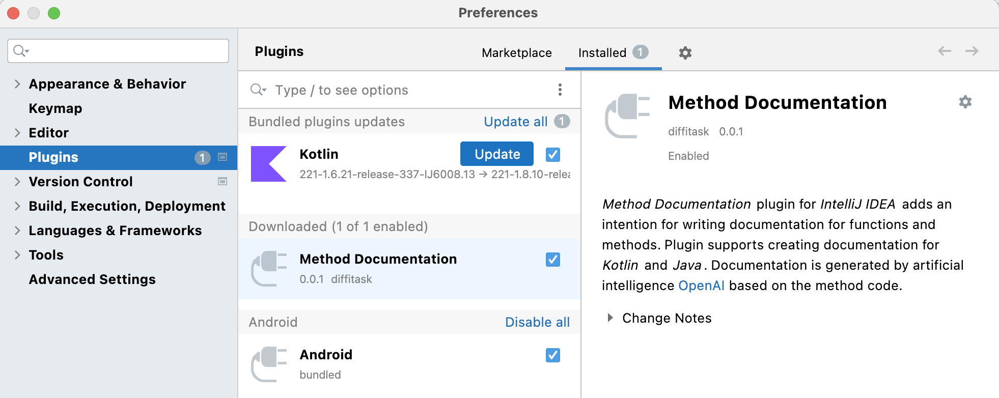
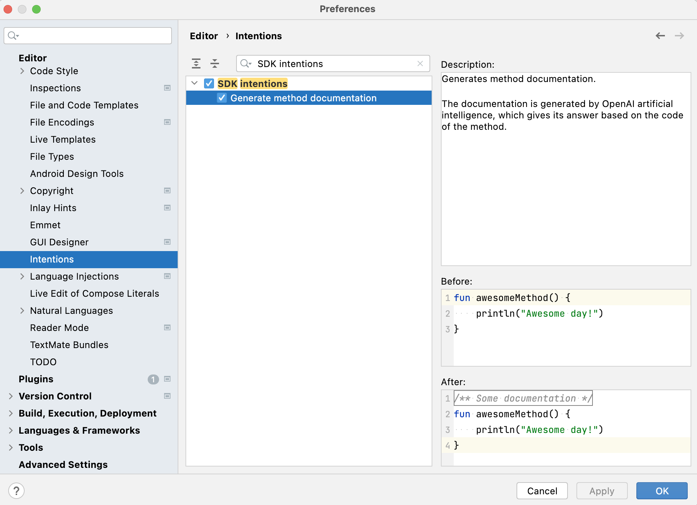
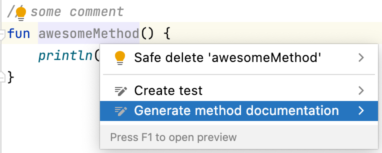

# Method Documentation IntelliJ plugin


<!-- Plugin description -->
*Method Documentation* plugin for IntelliJ IDEA adds an intention for writing documentation for functions and methods.
Plugin
supports creating documentation for Kotlin and Java. Documentation is generated by artificial
intelligence [OpenAI](https://platform.openai.com) based on the code of the method.
<!-- Plugin description end -->

## Table of readme content

* [Installation and running](#installation-and-running)
    * [Adding OpenAI API secret key](#important--add-your-openai-api-secret-key)
    * [Running](#running)
* [How does it work?](#how-does-it-work)
    * [Description](#description)
    * [Example of the plugin work](#example-of-the-plugin-work)
* [Tests](#tests)

## Installation and running

### Important! Add your OpenAI API secret key

Before running the plugin, it is necessary to **get your unique OpenAI API secret key**, which can be generated
here: [OpenAI API keys](https://platform.openai.com/account/api-keys), and then **write it** on the line number 81
in
the ['MethodDocumentationIntentionAction.kt'](https://github.com/diffitask/method-doc-intellij-plugin/src/main/kotlin/com/methoddoc/intention/MethodDocumentationIntentionAction.kt)
file, so that relevant documentation can be created.

Otherwise, the same stub will always be shown as the documentation.

### Running

To run the plugin, download this [*method-doc-intellij-plugin*](https://github.com/diffitask/method-doc-intellij-plugin)
project and choose *Run Plugin* in Run Configurations.

Method Documentation plugin will be automatically installed in the created IDE:

<kbd>Settings/Preferences</kbd> > <kbd>Plugins</kbd> > <kbd>Installed</kbd> > <kbd>Method Documentation</kbd>



When launched, this plugin adds the **Generate method documentation** item to the **SDK intentions** node in the
Intentions list:

<kbd>Settings/Preferences</kbd> > <kbd>Editor</kbd> > <kbd>Intentions</kbd> > <kbd>SDK intentions</kbd> > <kbd>Generate
method documentation</kbd>



## How does it work?

### Description

The plugin analyzes symbols under the cursor in the code opened in the editor. If the cursor is located above the
method name, IntelliJ IDEA proposes to create documentation for this method, if it hasn't yet exist, or replace the
previous one:



If there were any comments related to the method before the function declaration, they are saved intact.

To generate the text of the documentation, a request, which contains the code of the corresponding method and an
instruction to write documentation for it, is sent to the [OpenAI](https://platform.openai.com) artificial
intelligence (model
*text-davinci-003*) through the [OpenAI API client](https://github.com/aallam/openai-kotlin).

### Example of the plugin work

##### Before

```kotlin
fun awesomeMethod(dayNumber: Int): String {
    return "Awesome day number $dayNumber!"
}
```

##### After

```kotlin
/**
 * Generates an awesome phrase for the specified day number.
 *
 * @param dayNumber The day number.
 * @return An awesome phrase for the specified day number.
 */
fun awesomeMethod(dayNumber: Int): String {
    return "Awesome day number $dayNumber!"
}
```

## Tests

To check the correctness of the plugin in various cases, there
are tests for Kotlin and Java code examples. To run the tests,
run ['MethodDocumentationIntentionTest.kt'](https://github.com/diffitask/method-doc-intellij-plugin/src/test/kotlin/com/methoddoc/intention/MethodDocumentationIntentionTest.kt)
class.

Tests considered the work of the plugin in the following cases:
* Methods without any documentation and comments above
  * Simple method
  * Complicated method with arguments and return value
* Methods with previous documentation
  * Only documentation before method declaration
  * Documentation and comment before method declaration
  * Documentation and many comments with some spaces before method declaration
* Wrong caret position -- it is expected that Method Documentation intention is not shown in such cases